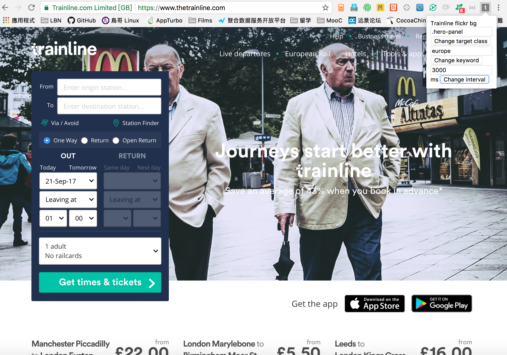

# Trainline flickr bg
This projet is a demo chrome extension to change image randomly of any HTML
element class on www.trainline.com with flickr's API

The propose of this plugin to get new feelings of Frontend by changing randomly images
Possible to find css bugs.

examples

# TODO
* add tests
* add linter
* redo popup
* etc
